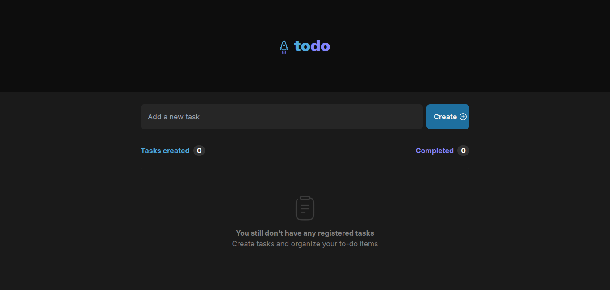
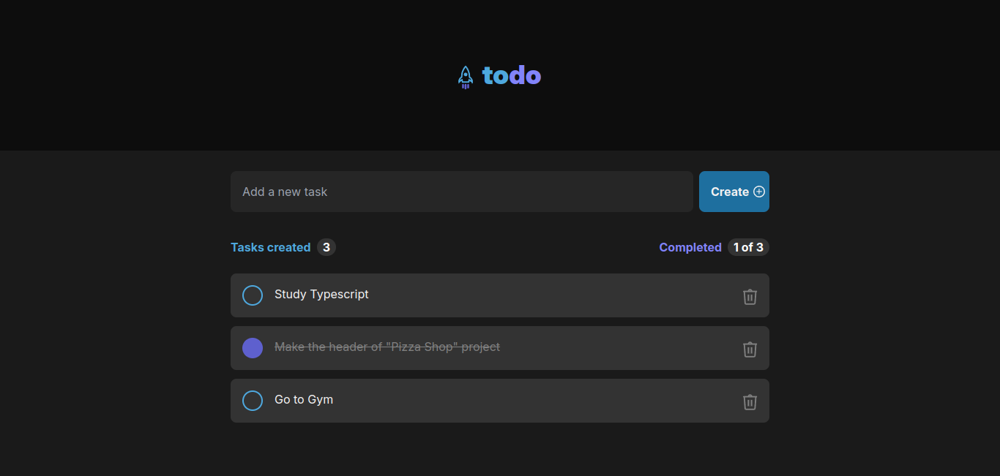

<p align="center"><h1 align="center">TO-DO-APP</h1></p>
<p align="center">
</p>
<p align="center">
	
	
	
	
</p>
<p align="center"><!-- default option, no dependency badges. -->
</p>
<p align="center">
	<!-- default option, no dependency badges. -->
</p>
<br>

##  Table of Contents

- [ Overview](#-overview)
- [ Features](#-features)

- [ Getting Started](#-getting-started)
  - [ Prerequisites](#-prerequisites)
  - [ Installation](#-installation)
  - [ Usage](#-usage)
- [ Contributing](#-contributing)
- [ License](#-license)

---

##  Overview

<span>Empty page:</span>



<span>Page with tasks:</span>



---


##  Getting Started

###  Prerequisites

Before getting started with to-do-app, ensure your runtime environment meets the following requirements:

- **Programming Language:** TypeScript
- **Package Manager:** Npm


###  Installation

Install to-do-app using one of the following methods:

**Build from source:**

1. Clone the to-do-app repository:
```sh
❯ git clone https://github.com/pedrogagodev/to-do-app
```

2. Navigate to the project directory:
```sh
❯ cd to-do-app
```

3. Install the project dependencies:


**Using `npm`** &nbsp; [](https://www.npmjs.com/)

```sh
❯ npm install
```


###  Usage
Run to-do-app using the following command:
**Using `npm`** &nbsp; [](https://www.npmjs.com/)

```sh
❯ npm start
```


---

##  Contributing

- **💬 [Join the Discussions](https://github.com/pedrogagodev/to-do-app/discussions)**: Share your insights, provide feedback, or ask questions.
- **🐛 [Report Issues](https://github.com/pedrogagodev/to-do-app/issues)**: Submit bugs found or log feature requests for the `to-do-app` project.
- **💡 [Submit Pull Requests](https://github.com/pedrogagodev/to-do-app/blob/main/CONTRIBUTING.md)**: Review open PRs, and submit your own PRs.

<details closed>
<summary>Contributing Guidelines</summary>

1. **Fork the Repository**: Start by forking the project repository to your github account.
2. **Clone Locally**: Clone the forked repository to your local machine using a git client.
   ```sh
   git clone https://github.com/pedrogagodev/to-do-app
   ```
3. **Create a New Branch**: Always work on a new branch, giving it a descriptive name.
   ```sh
   git checkout -b new-feature-x
   ```
4. **Make Your Changes**: Develop and test your changes locally.
5. **Commit Your Changes**: Commit with a clear message describing your updates.
   ```sh
   git commit -m 'Implemented new feature x.'
   ```
6. **Push to github**: Push the changes to your forked repository.
   ```sh
   git push origin new-feature-x
   ```
7. **Submit a Pull Request**: Create a PR against the original project repository. Clearly describe the changes and their motivations.
8. **Review**: Once your PR is reviewed and approved, it will be merged into the main branch. Congratulations on your contribution!
</details>

<details closed>
<summary>Contributor Graph</summary>
<br>
<p align="left">
   <a href="https://github.com{/pedrogagodev/to-do-app/}graphs/contributors">
      
   </a>
</p>
</details>

---

##  License

This project is protected under the [MIT](https://choosealicense.com/licenses/mit/) License. For more details, refer to the [LICENSE](https://choosealicense.com/licenses/) file.

